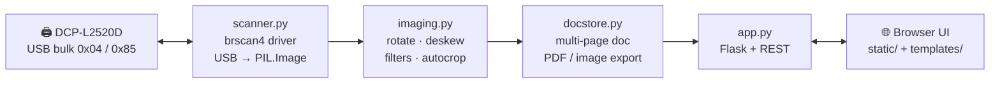

<div align="center">

# Brother DCP‑L2520D — Scanner Web UI

**A self‑contained web scanner for the Brother DCP‑L2520D that talks to the device directly over USB.**
No SANE, no `brscan4`, no proprietary drivers — just Python and `libusb`.
**Built for ARM Linux** (Raspberry Pi, `aarch64` / `armhf` SBCs) where Brother's own backend has no build.

[](LICENSE)


%20%C2%B7%20x86__64-orange)


</div>

---

Plug the printer into a Linux box (a Raspberry Pi is ideal), run one Flask app, and scan
from any browser on your network. Pages stack into a single document you can rotate,
deskew, clean up, OCR, and export to a print‑ready PDF or images.

The interesting part is `scanner.py`: a from‑scratch reimplementation of Brother's
**brscan4** USB protocol in ~250 lines of Python. Brother's official scanner backend is a
closed‑source binary blob shipped only for `x86` / `x86_64` — there is **no ARM build**, so
it simply doesn't run on a Raspberry Pi or any `aarch64` / `armhf` board. `pyusb` + `libusb`
are architecture‑independent, so this project runs anywhere Python does. Developed and
benchmarked on a Raspberry Pi 5 (`aarch64`); also works on x86_64.

## Features

| | |
|---|---|
| 🔌 **Direct USB** | Pure `pyusb` / `libusb`. No SANE, no `sane-airscan`, no Brother `.deb`. |
| 🦾 **ARM‑native** | Runs on `aarch64` / `armhf` (Raspberry Pi, SBCs) where Brother ships no driver — and on x86_64 too. |
| 📚 **Multi‑page documents** | Scan, swap the page, scan again — everything merges into one document. Drag to reorder. |
| 🎚️ **Per‑page editing** | 90° / fine rotation, auto‑deskew, and 11 image filters (flat‑field, adaptive B&W, unsharp, despeckle, auto‑crop…). |
| 🧾 **Print‑ready PDF** | Assemble to exact A4 / Letter / Legal points, or keep native pixel size. Colour / grey / 1‑bit per export. |
| 🔍 **Searchable PDF** | Optional Tesseract OCR layer (English by default; Vietnamese also supported). |
| 🖼️ **Image export** | Single PNG/JPG, or a ZIP for multi‑page. Quality slider. |
| ⚪ **Blank‑page detection** | Warns when a page came out empty so you don't ship a 6‑page PDF with 3 blanks. |
| ⌨️ **Keyboard‑first** | <kbd>Space</kbd> to scan, arrows to page through the lightbox. |
| 🪶 **Tiny footprint** | Flask + Pillow + NumPy + PyMuPDF. Runs comfortably on a Pi. |

## Why not just use SANE?

On x86 desktop Linux, `brscan4` + SANE mostly works. On a headless ARM server or a
Raspberry Pi it is a bad time:

- Brother ships **closed‑source** `brscan4` as `x86` / `x86_64` binaries only — **no `aarch64`,
  no `armhf`**. On a Pi it will not install or run, full stop.
- `sane-airscan` needs the printer's **eSCP/AirScan** service — the DCP‑L2520D doesn't have one.
- The SANE dependency chain (`libsane`, udev quirks, `saned`) is heavy for "I just want a JPEG."

`pyusb` talks to `libusb`, which is built for every architecture Linux runs on, so this
approach has no such blind spot.

The DCP‑L2520D speaks a simple, legible protocol over a USB bulk pipe. Once you know the
handshake it's a couple hundred lines. So that's what this is.

## Architecture



| Module | Responsibility |
|---|---|
| **`scanner.py`** | Open the USB session, send the scan command, parse the raster stream, hand back a `PIL.Image`. Zero other project deps. |
| **`imaging.py`** | Stateless image ops. Every filter is `f(image, params) -> (image, notes)`. |
| **`docstore.py`** | The current document (`data/current.json`), per‑page originals/previews/thumbs, and all export formats. |
| **`app.py`** | ~25 JSON endpoints + static file serving. Scanning runs on a worker thread with cancel + progress. |

## Inside the driver — brscan4 over USB

`scanner.py` reverse‑implements the protocol used by Brother's `libsane-brother4` backend.
The essentials:

```
Session open   ctrl_transfer(0xC0, 0x01, 0x0002, 0, 5)     # bit 0x80 in reply = device wedged, power‑cycle
Scan command   b"\x1bX\n" + "R=<dpi>,<dpi>\n"              # ESC X  = start
                            + "M=CGRAY|GRAY256|ERRDIF\n"   # colour / grey / 1‑bit
                            + "C=NONE\n"                    # uncompressed raster
                            + "A=0,0,<w>,<h>\n" + b"\x80"   # scan window, then go
Raster stream  <hdr><wrapper_len:2><wrapper><data_len:2><data> …
                 hdr & 0x1C → plane   (0x00 mono, 0x04/0x08/0x0C colour)
                 hdr & 0x03 → 2 means PackBits‑compressed
Cancel         write b"\x1bR"
Session close  ctrl_transfer(0xC0, 0x02, 0x0002, 0, 5)
```

Two gotchas that cost real debugging time and are now baked in:

- **Colour planes are YCbCr, not RGB.** The record headers say `R/G/B`, but plane `0x08` is
  luma and `0x04` / `0x0C` are the chroma channels. Treat them as RGB and every white page
  renders flat green. `decode_image()` does the proper `YCbCr → RGB` matrix.
- **There is no end‑of‑page marker.** When the page is done the device switches to an
  unbroken stream of zero‑length USB packets, forever. The read loop treats a short data
  gap as EOF and backs off so it isn't spinning a core on ~8000 empty reads a second.

### Performance

The scan head itself is the hard floor (~1.2 MB/s at 300 dpi grey, ~2.7 MB/s at 600 dpi
colour on USB 2.0) — no driver change moves that. What the driver *can* cut is the dead time
around the transfer: bigger bulk reads, a fast stale‑byte drain, gap‑based end‑of‑page
detection instead of a fixed multi‑second wait, one automatic retry when the device answers
the first request with silence, and zero‑copy hand‑off of raster planes to NumPy.

**Result, measured on a Raspberry Pi 5, A4 flatbed, 300 dpi grey — trigger to image ready:
14.1 s → 7.2 s (~2×).**

## Quick start

### 1. Requirements

- Linux on **ARM (`aarch64` / `armhf`) or x86_64**, Python **3.9+**, a Brother **DCP‑L2520D** on USB (`04f9:0324`).
- `libusb-1.0` (`sudo apt install libusb-1.0-0`).
- Optional, for searchable PDFs: `sudo apt install tesseract-ocr tesseract-ocr-vie`.

### 2. USB permissions (run as a normal user)

```bash
echo 'SUBSYSTEM=="usb", ATTR{idVendor}=="04f9", ATTR{idProduct}=="0324", MODE="0666", GROUP="plugdev"' \
  | sudo tee /etc/udev/rules.d/60-brother-dcpl2520d.rules
sudo udevadm control --reload-rules && sudo udevadm trigger
```

Make sure your user is in the `plugdev` group, then replug the printer.

### 3. Install & run

```bash
git clone https://github.com/tvminh19/brother-dcp-l2520d-scanner.git
cd brother-dcp-l2520d-scanner
python3 -m venv .venv && . .venv/bin/activate
pip install -r requirements.txt

./start.sh          # or: python app.py
```

Open **http://localhost:8090** (or `http://<server-ip>:8090` from another device).
Put paper on the glass, press **Scan** (or <kbd>Space</kbd>).

### Run it as a service

Any process manager works. With systemd:

```ini
# /etc/systemd/system/scanner-ui.service
[Unit]
Description=Brother DCP-L2520D Scanner Web UI
After=network.target

[Service]
User=youruser
WorkingDirectory=/opt/brother-dcp-l2520d-scanner
ExecStart=/opt/brother-dcp-l2520d-scanner/.venv/bin/python app.py
Restart=on-failure

[Install]
WantedBy=multi-user.target
```

## Configuration

Most knobs are module‑level constants — no config file.

| Where | Constant | Default | Purpose |
|---|---|--:|---|
| `app.py` | `app.run(port=…)` | `8090` | HTTP port (binds `0.0.0.0`). |
| `scanner.py` | `READ_CHUNK` | `256 * 1024` | Bytes per USB bulk read. |
| `scanner.py` | `FIRST_BYTE_TIMEOUT` | `15.0` | Seconds to wait for the first raster byte before retrying. |
| `scanner.py` | `IDLE_EOF` | `2.5` | A data gap this long = page finished. |
| `scanner.py` | `MAX_SECONDS` | `900` | Absolute ceiling for one page. |
| `docstore.py` | `VIEW_MAX_PX` | `2600` | Long edge of the on‑screen preview PNG (original stays full‑res). |
| `docstore.py` | `PAPER_PT` | A4/Letter/Legal | Exact PDF page sizes in points. |

Runtime data lives under `data/` (`current.json`, `pages/`, `exports/`) and is git‑ignored.
Delete `data/current.json` to start a fresh document.

## Contributing

Issues and PRs welcome. Useful things: other DCP/MFC models confirmed working (the protocol
is close across the `brscan4` family — a tested `VID`/`PID` and mode table is a great PR),
better deskew, packaging. Keep `scanner.py` dependency‑free (USB + Pillow + NumPy only).
ADF support and PackBits decompression are deliberately out of scope: this model is
flatbed‑only, and the scan head — not the USB link — is the real bottleneck.

## Acknowledgements

- The **[SANE Project](http://www.sane-project.org/)** `brother4` backend and community
  protocol notes — the map for the reverse‑engineering here.
- [PyMuPDF](https://pymupdf.readthedocs.io/), [Pillow](https://python-pillow.org/),
  [Tesseract](https://github.com/tesseract-ocr/tesseract).

## Disclaimer & trademark

This is an independent, community project and is **not affiliated with, endorsed by, or
sponsored by Brother Industries, Ltd.** "Brother" and "DCP‑L2520D" are trademarks of Brother
Industries, Ltd.; they are used here only to identify the hardware this software is
compatible with. No Brother source code, firmware, or binaries are included or redistributed
— every protocol detail here was derived from observing USB traffic and from public
community documentation (see Acknowledgements). Provided **"as is," with no warranty**; use
at your own risk. See [LICENSE](LICENSE).

## License

[MIT](LICENSE) © 2026 tvminh19
